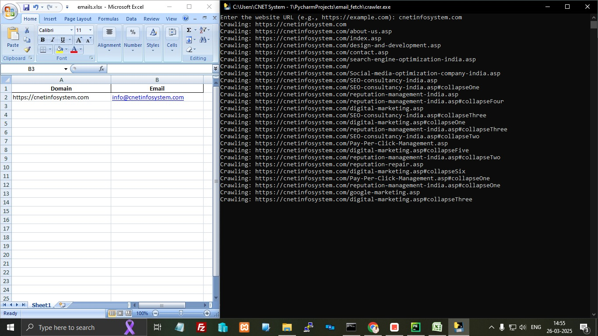

# Email Fetch Tool

A Python-based tool to fetch emails by crawling all pages within a given domain and export them to Excel format.

## Features

- Fetch all emails from specified domain
- Export emails to Excel (.xlsx) format
- Filter emails based on date range
- Easy-to-use executable format

## Quick Start

1. Download the [crawler.exe](crawler.exe) file
2. Run the executable
3. Enter your email credentials when prompted
4. Wait for the process to complete
5. Find your exported emails in `email.xlsx`

## Sample Output

The exported Excel file (`email.xlsx`) will contain the following information:
- Domain
- Email

## Requirements

If running from source code:
- Python 3.7+
- Required packages listed in `requirements.txt`

For executable:
- Windows 7/8/10/11

## License

MIT License

## Contributing

Feel free to open issues and pull requests!